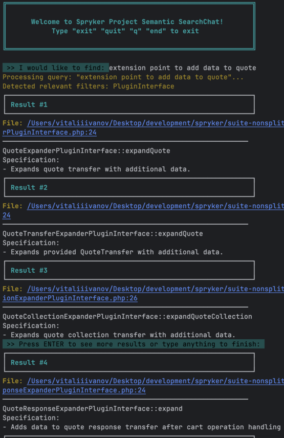
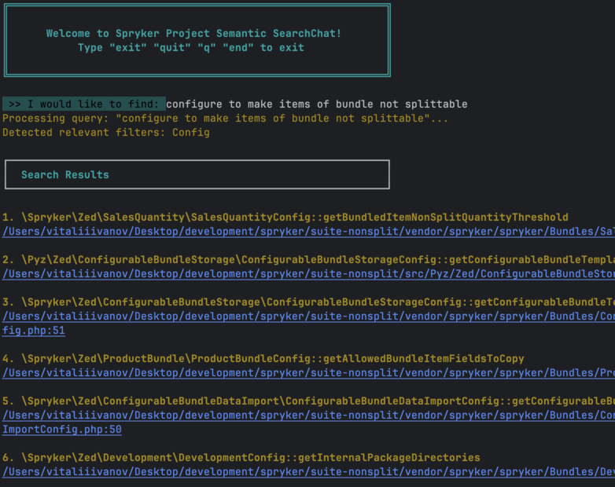
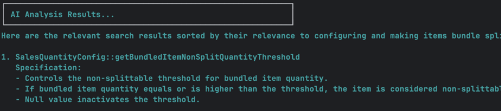
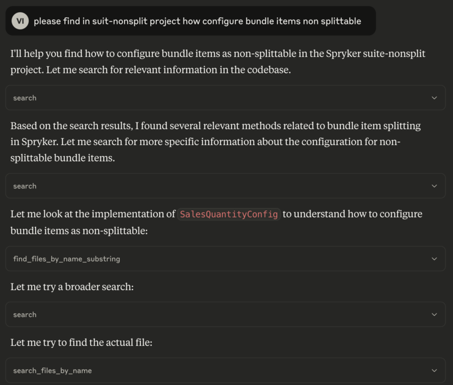
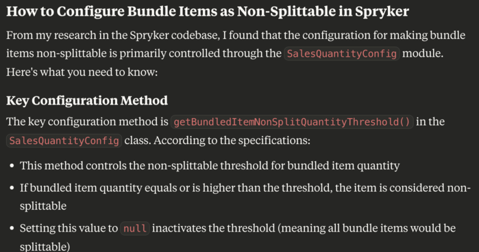
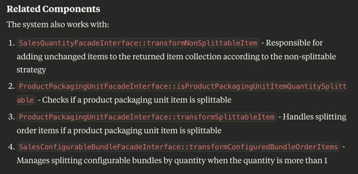

# 🔍 Spryker Project Semantic Search Tool

The **Spryker Project Semantic Search Tool** enables intelligent, context-aware search across your Spryker project using Large Language Model (LLM)-based embeddings and [Chroma DB](https://www.trychroma.com/) for efficient indexing and retrieval.

## 🧩 Problem

Spryker applications consist of a vast and growing number of module APIs, including Facades, Clients, and various Plugin interfaces used as extension points.
Due to this complexity, identifying the right module or method for a specific task can be time-consuming and error-prone, especially for new developers or when working across multiple feature sets.

## ✨ Features

- **Indexes key module APIs and configurations**, including:
    - `Facade` interfaces
    - `Client` interfaces
    - `Service` interfaces
    - `Plugin` interfaces and plugin classes
    - `Config` classes of modules

- **Semantic understanding of code**:
    - Uses class and method names (module APIs)
    - Incorporates method doc blocks for deeper intent and specification analysis
    - Does not use full file code

- **Security Measures**:
    - Prevents exposure of sensitive project data by operating in local mode.
    - Extracts only semantic information from module APIs, without analysing underlying code implementations.

- **Efficient navigation and output**:
    - Presents results in **chunked format** for readability
    - Each result includes a **link to the source file and line number** for quick access
    - Various AI modes for better usability

## 🧠 How It Works

1. **Embeddings Generation**: Creates vector embeddings for indexed elements using a Large Language Model (LLM).
2. **Indexing**: Stores embeddings in Chroma DB for fast semantic search.
3. **User Query**: Accepts natural language input.
4. **Matching & Ranking**: Finds semantically relevant matches across the project and summarises with AI.
5. **Result Presentation**: Displays readable chunks with direct links to source files.

## 📦 Use Cases

- Understand large or unfamiliar Spryker codebases faster.
- Discover relevant module APIs and plugins by *use case*, not just name.
- Accelerate onboarding for new developers and cross-team collaboration.

---
> 💡 **Tip**: Works best when combined with up-to-date PHPDoc across modules for optimal semantic accuracy.

## 🔍 Filtering

The tool supports advanced Machine Learning-based filtering detection.
To use this feature, simply mention it in your query — no additional setup is required beyond providing a suitable Facade, Configuration, Client, Plugin etc.
Additionally, the tool is capable of understanding extended filter definitions configured in `\Spryker\Config::getDataTypeTrainData`,
which you can override to customize detection behavior for your specific use case.

## 🧪 Examples:

### Native mode



### Native plus AI mode




## 📦 Prerequisites

Ensure you have the following installed on your machine:

- [Docker](https://www.docker.com/)
- [Docker Compose](https://docs.docker.com/compose/)
- [Composer](https://getcomposer.org/)
- Bash shell

---

## 🛠 Installation & Setup

1. Clone the repository into the project root directory:
```bash
   git clone git@github.com:vitaliiivanovspryker/spryker-project-semantic-search.git &&
   echo "/spryker-project-semantic-search/" >> .git/info/exclude &&
   cd spryker-project-semantic-search &&
   cp php/.env.example php/.env
````
2. Configure environment in `spryker-project-semantic-search/php/.env`

3. Run the installer script:

```bash
bash install
```

   This will:

    * Start Docker containers
    * Install dependencies via Composer
    * Pull ollama embedding model nomic-embed-text
    * Index the project (takes 5–20 minutes)
    * Launch the interactive CLI tool

---

## 📂 Project Structure

```
├── spryker-project/
│      ├── src/
│      │    └── Pyz/
│      ├── ...
│      └── spryker-project-semantic-search/
│           ├── php/
│           │    └── bin/
│           │         └── sprykeye
│           ├── docker-compose.yml
│           ├── php.ini
│           ├── install
│           ├── run
│           └── readme.md
```

---

## 🧪 Usage

After setup, you can launch the search tool anytime by running:

```bash
docker exec -it php bash -c "bin/sprykeye project:search"
```
or
```bash
bash run
```

## MCP server makes the tool compatible with various AI agents to extend context with Spryker Project context

### Tools:
 - [Claude desktop](https://claude.ai/download)
 - [JetBrains AI Assistant plugin](https://plugins.jetbrains.com/plugin/22282-jetbrains-ai-assistant)
 - [Qodo Gen JetBrains plugin](https://plugins.jetbrains.com/plugin/21206-qodo-gen)
 - [Windsurf](https://docs.windsurf.com/windsurf/mcp)
 - [Cursor](https://docs.cursor.com/context/model-context-protocol)
 - [Cursor](https://docs.cursor.com/context/model-context-protocol)
 - etc.

### [How to configure?](mcp/readme.md)

### Example:




## 📈 Roadmap

- Controller classes indexing (public methods);
- Dependency provider's extension points;
- Filtering by Module name;
- AI chat mode - discuss with AI results or better query;
- AI: search with remote AI agent (Gemini, OpenAI, etc.);

## 📄 License

MIT or your preferred license.

---

## 👥 Authors

* [Vitalii Ivanov](https://www.linkedin.com/in/vitalii-ivanov-306b261a3/)

